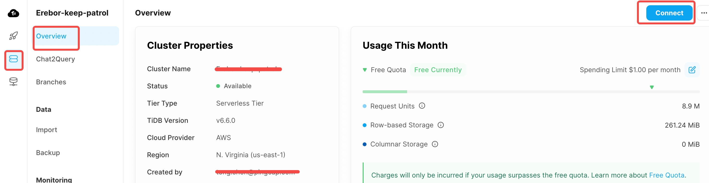
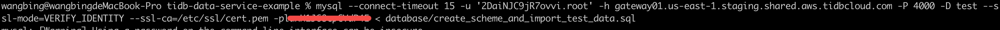

# TiDB Cloud Data Service Guide

TiDB Cloud is a powerful and user-friendly cloud-based database platform. This comprehensive guide aims to offer detailed instructions on leveraging the TiDB Cloud Data Service to construct a straightforward dashboard app using less than 100 lines of code.

To begin with, you can refer to the Data Service documentation and try out the online demo to gain familiarity with the platform.

- [Access the Data Service Documentation for more information](https://docs.pingcap.com/tidbcloud/data-service-overview)
- [Check out the online demo of the dashboard app](https://data-service-example.vercel.app/)


## Prepare the data source

Before you can start building your dashboard app, you need to prepare your environment. You can do this by signing in to TiDB Cloud and creating a free Serverless Cluster. Simply access [the TiDB Cloud website](https://tidbcloud.com/), sign in using your Google or GitHub account, and click the "Create Cluster" button. Select the "Serverless" option to generate a free cluster that automatically scales based on your usage.

Once your cluster is set up, you can begin exploring the sample data provided by TiDB Cloud. The sample dataset that we will explore is a table called `sold_car_orders`, we need to import this data at first.
1. Log in to [tidbcloud.com](https://tidbcloud.com) and select the Cluster project from the left sidebar. Click `connect` button to get a `mysql` command.


2. Import local data to this database.


## Step-by-step: build & deploy

### Create a new DataAPP in TiDB Cloud
1. Log in to [tidbcloud.com](https://tidbcloud.com) and select the DataService project from the left sidebar. On the DataService page, create a new DataAPP. Turn off the `Connect to GitHub` switch, install GitHub with instructions.


> Note:
> * If there are no clusters existing under your project, you can click on create cluster to first create a database. Once the database is created, proceed to create a new DataAPP.
> * If you have already created a DataAPP, check the top-right corner of the DataAPP sidebar.

2. Take note of the `{APP_ID}` for the current DataAPP creation and the `{CLUSTER_ID}` associated with the cluster. We will need these two values later to configure the backend code repository.


### Associate your github repo with TiDB Cloud DataAPP
1. Connect your github repo with DataAPP
Click the `connect` button in the connect to Github area of the configuration page.


In the pop-up window, follow the prompts to complete the corresponding operation steps


> Note: After turning on the 'Connect to GitHub' switch, you need to complete the following steps:
> * Bind the Github App Service with the corresponding GitHub project, and grant permission to operate on the respective repository.
> * Click the 'authorize' button.
> * Associate the corresponding backend configuration directory with the current DataAPP

2. Trigger the DataAPP deployment via git push

In this step, we need to configure the previously recorded `{APP_ID}` and `{CLUSTER_ID}` into the current code repository, and then execute commit && push to trigger the deployment of the DataAPP.

Perform the following actions in the 'backend' directory of the code repository:

**For Mac systems:**
```bash
cd ./dataapp_config
sed -i '' 's/${APP_ID}/{your app ID}/g' dataapp_config.json
sed -i '' 's/${CLUSTER_ID}/{your cluster ID}/g' ./data_sources/cluster.json
sed -i '' 's/${CLUSTER_ID}/{your cluster ID}/g' ./http_endpoints/config.json
```

**For Linux systems:**
```bash
cd ./dataapp_config
sed -i  's/${APP_ID}/{your app ID}/g' dataapp_config.json
sed -i  's/${CLUSTER_ID}/{your cluster ID}/g' ./data_sources/cluster.json
sed -i  's/${CLUSTER_ID}/{your cluster ID}/g' ./http_endpoints/config.json
```

After the replacement is completed, execute the git commit && push operation.

```bash
git commit . -m "update the param config"
git push
```

At this point, go back to the webpage of the DataAPP, and you will see a deployment record from GitHub. This deployment record is triggered and deployed through GitHub.+


At the same time, you can see four endpoints successfully imported from Github on the left pane of the `data-service-example`:
- GET `/total_order_per_year` Total number of cars sold per year
- GET `/avg_price_per_year` Average car selling price per year
- GET `/order_by_brand_year?year=${year}` Brand ranking of car sales in a certain year
- GET `/price_by_brand_year?year=${year}` Brand ranking of car prices in a certain year

3. Verify the DataAPP deployment is successful

We have completed the creation of DataAPP and now we are testing if our newly created DataAPP works appropriately.

#### Create an ApiKey {publickey}:{privatekey} in DataAPP and save it to local.

On the authentication property of the data app property page, click the Create API Key button. This will generate a {publickey}:{privatekey} pair.


> Note:
> 1. API Key has two roles: `ReadAndWrite` and `ReadOnly`, which represent the database operation permission for that key. It is recommended to create a `ReadAndWrite` type APIKey directly. 
> 2. After clicking API Key creation, DataService will **ONLY** return the corresponding key content at this time. Please click copy everything to store the corresponding key value locally. We will use this key for related access operations later.

#### Choose an endpoint and test if it is working correctly.

Click on any endpoint in DataAPP and click code example in the right side panel; click online environment in the pop-up window, copy the curl command in it to local.


Replace the fields `<PublicKey>` and `<PrivateKey>` in the copied content with the previously generated `public key` and `private key`. Send the request on the command line. If the corresponding data is returned normally, it indicates that the current DataAPP has been set up successfully.


### Launch the web application

#### Build and deploy the web app demo

Next, we'll implement the web app using the full-stack framework Next.js and deploy it conveniently via Vercel within 3 minutes.
After forked and updated the demo app repository, clone the repository to local, create a `.env` file in the root directory to specify some environment variables that shouldn't be hardcoded in the source code and can be easily changed on-the-fly

```bash
TIDBCLOUD_DATA_SERVICE_PUBLIC_KEY=YOUR PUBLIC_KEY
TIDBCLOUD_DATA_SERVICE_PRIVATE_KEY=YOUR PRIVATE_KEY
TIDBCLOUD_DATA_SERVICE_HOST=https://us-east-1.data.tidbcloud.com/api/v1beta/app/dataapi-xxxxxx/endpoint
```

Run commands below to start a local dev server. If things go well, you could see the demo as the screenshot.

```bash
npm i && npm run dev
```

Deploy our demo app to [Vercel](https://vercel.com/) only take 3 minutes! Visit Vercel, register an account if you don't have one. Import the Git repository we forked & updated.


Add environmental variables here, and press the Deploy button, wait some minutes and all things get to work!


### Check the result

Upon successful deployment, the functioning of the app would look like the following, and we've finished the production deployment!


### Summary
TiDB Cloud Data Service provides a fully-managed web app experience, significantly reducing the cost of operations. Users only need to focus on their repositories, while TCDS takes care of the rest. This service leads to:

1. An increase in development efficiency, thus shortening the development cycle.
2. A reduction in operating costs due to the fully managed nature of the service.

TiDB Cloud and TCDS empower developers to build and deploy applications with fewer hurdles and greater efficiency. You can start using TCDS today with a free account on TiDB Cloud.

## Core code analysis

### Build APIs

Our dashboard includes the following data:

- Annual sales of car orders for the past years and the average selling price for all orders in those years(line chart)
- Top 10 car brands and models with the highest sales order count and highest selling price for a given year(item list)

This can be done by 4 corresponding APIs:

- GET `/total_order_per_year`
- GET `/avg_price_per_year`
- GET `/order_by_brand_year?year=${year}`
- GET `/price_by_brand_year?year=${year}`

Using the TiDB Cloud **Data Service**, we can easily create and deploy these APIs with just a few clicks.

> The first two APIs are straightforward and if needed, you can also get help from the AI feature, simply type "-- [your question text here]" then hit the `Enter` key to try out these AI-generated SQL queries.

```sql
-- GET `/total_order_per_year`
use sample_data;

SELECT
  `year`,
  COUNT(*) AS order_count
FROM
  `sold_car_orders`
GROUP BY
  `year`
ORDER BY
  `year`;

-- GET `/avg_price_per_year`
use sample_data;

SELECT
  `year`,
  AVG(`selling_price`) AS `price`
FROM
  `sample_data`.`sold_car_orders`
GROUP BY
  `year`
ORDER BY
  `year`;
```

You can click the `Deploy` button in the upper right corner to deploy them to the public network and use the command provided in the `Code Example` to test them. Of course, to protect the security of the API, you need to create a pair of keys for authentication, which can be easily configured by clicking on your DataApp.

The next two APIs require dynamic parameter injection. We can use syntax like `${year}` to represent them and pass in given values in the Params panel on the right for testing. For GET APIs, these parameters need to be passed in through the query in the URL, while for POST APIs, they need to be included in the request body as JSON strings.

```sql
-- GET `/order_by_brand_year`
use sample_data;

SELECT
  name,
  COUNT(*) AS order_count
FROM
  `sold_car_orders`
WHERE
  `year` = ${year}
GROUP BY
  `name`
ORDER BY
  order_count DESC
LIMIT 10;

-- GET `/price_by_brand_year`
use sample_data;

SELECT DISTINCT
  `name`,
  `selling_price` as `price`
FROM
  `sold_car_orders`
WHERE
  `year` = ${year}
ORDER BY
  `selling_price` DESC
LIMIT
  10;
```

### Build the front-end

Next, we'll implement the front-end using Next.js and deploy it conveniently via Vercel. To initialize the project, use the `npx create-next-app@latest` command. Once complete, create a `.env` file in the root directory to specify some environment variables that shouldn't be hardcoded in the source code and can be easily changed on-the-fly:

```
TIDBCLOUD_DATA_SERVICE_PUBLIC_KEY=PUBLIC_KEY
TIDBCLOUD_DATA_SERVICE_PRIVATE_KEY=PRIVATE_KEY
TIDBCLOUD_DATA_SERVICE_HOST=https://us-east-1.data.tidbcloud.com/api/v1beta/app/dataapi-xxxxxx/endpoint/v1
```

This will enable us to pass these variables through the `with-digest-fetch` library to safely authenticate API requests:

```js
import DigestFetch from "with-digest-fetch";

const client = new DigestFetch(
  process.env.TIDBCLOUD_DATA_SERVICE_PUBLIC_KEY!,
  process.env.TIDBCLOUD_DATA_SERVICE_PRIVATE_KEY!
);
client.fetch(...)
```

To work around cross-origin restrictions, let's create a forwarding API interface using Next.js API router. Create an `api/gateway/[path].ts` file under the `pages` folder, and extract the corresponding `path` parameter from incoming requests to forward them to the appropriate TiDB Cloud Data Service API.

```ts
const fetcher = async (key: string, body?: Record<string, any>) => {
  const url = `${process.env.TIDBCLOUD_DATA_SERVICE_HOST}/${key}`;
  const res = await client.fetch(url, {
    body: body ? JSON.stringify(body) : body,
  });
  return await res.json();
};

export default async function handler(
  req: NextApiRequest,
  res: NextApiResponse
) {
  const { path, ...rest } = req.query;

  const searchParams = new URLSearchParams();
  for (const key in rest) {
    searchParams.append(key, rest[key] as string);
  }
  const url =
    Object.keys(rest).length > 0
      ? `${path}?${searchParams.toString()}`
      : (path as string);

  const response = await fetcher(url);
  res.status(200).json(response);
}
```

Now, it's time to focus on the implementation of the front-end code for the browser. Once we retrieve the correct data through the API, we will use `Chart.js` to render them.

Check the component code in `pages/index.tsx`. For ease of calling the API in React, we use the library `swr` as follows:

```ts
const fetcher: Fetcher<any, any> = (
  input: RequestInfo | URL,
  init?: RequestInit
) => globalThis.fetch(input, init).then((res) => res.json());

const { data: orderByYearData } = useSWR(
  `/api/gateway/total_order_per_year`,
  fetcher as Fetcher<OrderByYearData, string>
);
const { data: avgPriceByYearData } = useSWR(
  `/api/gateway/avg_price_per_year`,
  fetcher as Fetcher<AvgPriceByYearData, string>
);
const { data: orderByBrandYearData } = useSWR(
  `/api/gateway/order_by_brand_year?year=${year}`,
  fetcher as Fetcher<OrderByBrandYearData, string>
);
const { data: topPriceByYearData } = useSWR(
  `/api/gateway/price_by_brand_year?year=${year}`,
  fetcher as Fetcher<TopPriceByYearData, string>
);
```

After retrieving the data, we configure some options for the chart, then pass in the data to render the desired line chart:

```tsx
const options = {
  responsive: true,
  plugins: {
    legend: {
      position: "top" as const,
    },
    title: {
      display: true,
      text: "Car Sales Trend",
    },
  },
};

const labels = orderByYearData?.data.rows.map((i) => i.year);
const datasets = [
  {
    data: orderByYearData?.data.rows.map((i) => Number(i.order_count)),
    label: "Number of Orders",
    borderColor: "rgb(53, 162, 235)",
    backgroundColor: "rgba(53, 162, 235, 0.5)",
  },
  {
    data: avgPriceByYearData?.data.rows.map((i) =>
      Math.round(Number(i.price) / 1000)
    ),
    label: "Average Selling Price (K)",
    borderColor: "rgb(255, 99, 132)",
    backgroundColor: "rgba(255, 99, 132, 0.5)",
  },
];

//render
<Line options={options} data={{ labels, datasets }} />;
```

For the remaining two datasets showing the top 10 rankings, we will not use a chart, but instead, directly display them in a list:

```tsx
function RankList(data: { value: number; name: string }[]) {
  return (
    <>
      {data.map((i, index, array) => (
        <div key={index}>
          <div title={i.name}>{i.name}</div>
          <div>{i.value.toLocaleString("en-US")}</div>
        </div>
      ))}
    </>
  );
}

function Home() {
  return (
    <div>
      <RankList
        data={
          orderByBrandYearData?.data.rows.slice(0, 10).map((i) => ({
            name: i.name,
            value: Number(i.order_count),
          })) ?? []
        }
      />

      <RankList
        data={
          topPriceByYearData?.data.rows.slice(0, 10).map((i) => ({
            name: i.name,
            value: Number(i.price),
          })) ?? []
        }
      />
    </div>
  );
}
```

For selecting the year, we can declare a state and allow the user to modify this state through a selector:

```tsx
const [year, setYear] = useState("2017");

<div>
  <span>Year:</span>
  <select value={year} onChange={(e) => setYear(e.target.value)}>
    {labels?.map((i) => (
      <option key={i} value={i}>
        {i}
      </option>
    ))}
  </select>
</div>;
```

## Finish

Next, we can further optimize the styling to make the page more attractive. With this, we have completed the development of this dashboard!

By using TiDB Cloud Data Service, what would have been several days of extensive backend API development work can now be done in just a couple of minutes. Furthermore, users are not burdened with deployment and operation concerns. All that remains is to push the code to GitHub and, with a few clicks on vercel.com, our app is online!

You can view the complete source code on our [GitHub repository page](https://github.com/tidbcloud/data-service-example), or try out our online demo [here](https://data-service-example.vercel.app/).
